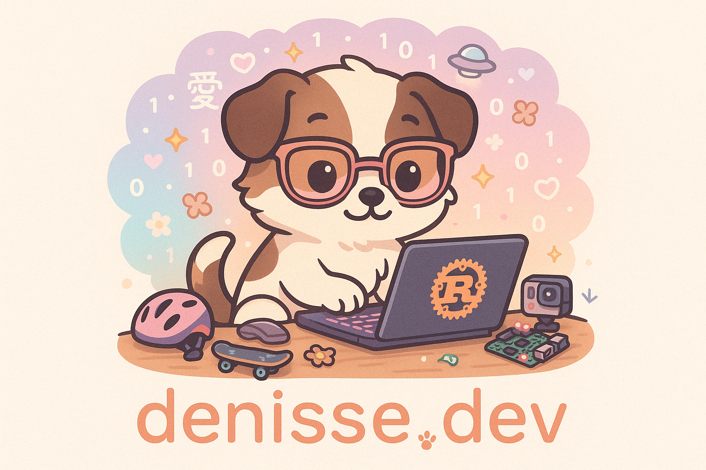

Passionate open source developer, Emacs lover, and Arch Linux tinkerer — sharing knowledge one keystroke (or solder joint) at a time.

 **Website:** [denisse.dev](https://denisse.dev)

 **Let's talk in:** ES/EN/中文

 **IRC LiberaChat nick:** `denisse`

 **Fluent in:** Rust, Python, and Go

 **Email address:** `hello at denisse dot dev`
